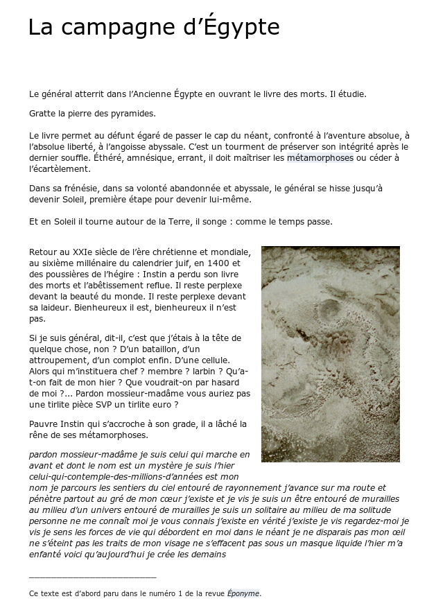
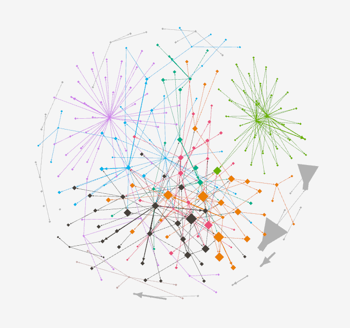

<!-- .slide: data-background-image="img/portier2.png" -->
<!-- .slide: class="hover"-->

## Des humanités numériques littéraires ?   Introduction au concept d'éditorialisation

Servanne Monjour

_École d'été du CRIHN (juin 2018)_

<!-- .element: style="font-size:1.4rem" -->

 <!-- .element: class="logo" -->

%%%%%%%%%%%%%%%%%%%%%%%%%%%%%%%%%%%%%%%%%%%%%

<!-- .slide: data-background-image="img/portier2.png" -->

§§§§§§§§§§§§§§§§§§§§§§§§§§§§§§§§§§§§§§§§§§§§§

<!-- .slide: data-background-image="img/portierEtantDonneeInaccessible.png" data-background-size="contain"--->

§§§§§§§§§§§§§§§§§§§§§§§§§§§§§§§§§§§§§§§§§§§§§

<!-- .slide: data-background-image="img/wyBackPortier.png" data-background-size="contain"--->

§§§§§§§§§§§§§§§§§§§§§§§§§§§§§§§§§§§§§§§§§§§§§
<!-- .slide: data-background-image="img/portierEtantDonneeInaccessible.png" data-background-size="contain"--->
<!-- .slide: class="hover"-->

### Tour d'horizon du problème...
* Des pratiques d'écriture hors le livre
* Un corpus fragile, disséminé et éphémère
* Des objets hyper/multimédiatiques
* Des méthodologies obsolètes
* Un nouveau rôle pour le chercheur

§§§§§§§§§§§§§§§§§§§§§§§§§§§§§§§§§§§§§§§§§§§§§

<!-- .slide: data-background-image="img/portierEtantDonneeInaccessible.png" data-background-size="contain"--->

<!-- .slide: class="hover"-->

### Questions de recherche

* Qu'est-ce que la littérature à l'époque du numérique&nbsp;?
* Quel impact ont les technologies sur les études littéraires&nbsp;?
* Quel patrimoine littéraire pour demain&nbsp;?
* L'éditorialisation (théorie + ensemble de pratiques) : une solution&nbsp;?

===

§§§§§§§§§§§§§§§§§§§§§§§§§§§§§§§§§§§§§§§§§§§§§

<!-- .slide: data-background-image="img/portierEtantDonneeInaccessible.png" data-background-size="contain"--->

<!-- .slide: class="hover"-->

### Sommaire

1. L'éditorialisation : présentation et discussion d'un concept

2. Étude de cas 1 : François Bon dans son chantier littéraire

3. Étude de cas 2 : le corpus fantôme du Général Instin

===

%%%%%%%%%%%%%%%%%%%%%%%%%%%%%%%%%%%%%%%%%%%%%

<!-- .slide: data-background-image="img/JEedito063.jpg" --->

## L'éditorialisation

§§§§§§§§§§§§§§§§§§§§§§§§§§§§§§§§§§§§§§§§§§§§§
<!-- .slide: data-background-image="img/ngramEditorialisation.png" -->
<!-- .slide: class="hover"-->

### Cartographie du concept
* Un néologisme récent (< 2004)
* Un concept interdisciplinaire
* Articulation théorie/pratique

===
Le terme éditorialisation est un néologisme récent, forgé à partir de 2004, pour désigner de nouvelles pratiques éditoriales issues des technologies numériques. Le concept reste encore instable et débattu : clairement il fait l’objet d’un intérêt très fort, mais sa définition est encore en construction.

Malgré ses frontières encore mouvantes (ce qui en fait d'ailleurs l'intérêt), le concept d'éditorialisation fédère un nombre croissant de chercheurs et d’institutions, dans une perspective interdisciplinaire. À vrai dire, les littéraires sont encore un peu à la traîne sur le terrain de l'éditorialisation, qui fait surtout l'objet d'études approfondies en info com (avec Louise Merzeau), philo (Gérard Wormser), design, bibliothéconomie...

Enfin, l’éditorialisation témoigne d'une forte volonté de faire dialoguer les théoriciens et les praticiens : ceux qui construisent des outils, des plateformes d’édition et de gestion des contenus, ceux qui réfléchissent aux conséquences culturelles, ontologiques de ces nouveaux outils. La notion implique en effet un dialogue constant entre théorie et pratique.  

Entre théorie et pratique, les praticiens sont ainsi amenés à développer une approche critique de leurs outils et environnement, et de leur côté, les théoriciens doivent nécessairement ancrer leurs concepts sur des cas concrets et une connaissance technique de l’environnement numérique.

§§§§§§§§§§§§§§§§§§§§§§§§§§§§§§§§§§§§§§§§§§§§§
<!-- .slide: data-background-image="./img/ngramEditorialisation.png" data-background-size="contain"-->
<!-- .slide: class="hover"-->

### 2004-2007: apparition du terme

  * Une "sorte" d'édition dans l'environnement numérique
  * Bruno Bachimont : le document numérique comme remédiation d'une ressource numérisée

===

Un auteur important : Bruno Bachimont qui met en avant le concept d'éditorialisation en 2007, dans un chapitre de *L’indexation multimédia* intitulé « Nouvelles tendances applicatives : de l’indexation à l’éditorialisation ».

Bruno Bachimont utilise le terme pour parler du passage d'un document non-numérique à un document numérique (on n’est pas seulement dans le texte littéraire, mais dans la question du document - archivistique et information)

§§§§§§§§§§§§§§§§§§§§§§§§§§§§§§§§§§§§§§§§§§§§§

<!-- .slide: data-background-image="./img/PostIt.jpg" data-background-size="contain"-->
<!-- .slide: class="hover"-->

> L’idée centrale de cet article est que l’indexation fine du contenu rendue possible pour le numérique introduit un rapport nouveau au contenu et au document. Alors que selon l’indexation traditionnelle l’enjeu est de retrouver le ou les documents contenant l’information recherchée, l’indexation fine du contenu permet de ne retrouver que les segments concernés par la recherche d’information et de paramétrer l’usage de ces segments. (...) Devenant des ressources, ces segments sont remobilisés pour la production d’autres contenus dont ils constituent les composants. La finalité n’est plus de retrouver des documents, mais d’en produire de nouveaux, à l’aide des ressources retrouvées. On passe ainsi de l’indexation pour la recherche à l’indexation pour la publication. Comme cette dernière s’effectue selon des règles et des normes, on parlera plutôt d’éditorialisation, pour souligner le fait que les segments indexés sont enrôlés dans des processus éditoriaux en vue de nouvelles publications.
>
> Bruno Bachimont, « Nouvelles tendances applicatives : de l’indexation à l’éditorialisation », in _L’indexation multimédia_, Paris, Hermès, 2007

<!-- .element: style="font-size:1.4rem" -->

===
Pour Bachimont, l'éditorialisation est le processus par lequel une ressource est remédiatisée et remédiée en un nouveau document numérique, impliquant la ré-interprétation de la ressource.

Pour le dire autrement : en changeant de milieu, le document est amené à devenir autre.
Le processus d'indexation multimédia n'est donc plus seulement une forme d'édition mais d'éditorialisation (l'éditorialisation venant ici désigner ce changement de nature qui s'opère)

§§§§§§§§§§§§§§§§§§§§§§§§§§§§§§§§§§§§§§§§§§§§§

<!-- .slide: data-background-image="img/Framapad.png" data-background-size="contain"-->
<!-- .slide: class="hover"-->

2008: institutionnalisation du concept
  * Séminaire «Écritures numériques et éditorialisation» (Sens Public, IRI, Dicen-IDF, UdeM)
  * De nouveaux documents et objets "natifs numériques"

===
À partir de 2008, le terme commence ainsi à s'institutionnaliser.

Notamment avec le séminaire "Écritures numériques et éditorialisation", où l'éditorialisation se conçoit comme un espace de débat et de réfléxion - nous vous invitons à consulter les archives vidéo disponibles en ligne, pour vous faire une idée plus précise de ce chantier théorique et pratique.

L'éditorialisation permet alors de penser un processus un peu plus complexe car ouvert à tous : auteurs, collectivités, plateformes (donc outils de type algorithme), dynamiques pratiques.

L'un des grand théoriciens du concept est Marcello Vitali-Rosati, dont nous allons présenter et discuter la pensée du concept.

§§§§§§§§§§§§§§§§§§§§§§§§§§§§§§§§§§§§§§§§§§§§§

<!-- .slide: data-background-image="img/inventaireAtom.png" data-background-size="contain"-->
<!-- .slide: class="hover"-->

> Davantage qu’un néologisme forgé pour marquer le passage au numérique, le concept d’éditorialisation vient répondre à des problématiques posées par ce nouveau modèle (numérique). Il est en effet essentiel de souligner (...) à quel point la notion d’éditorialisation peut changer notre manière d’habiter l’espace numérique. Parce qu’elle en souligne la structure, l’éditorialisation nous donne la possibilité de comprendre l’espace numérique et de comprendre le sens de nos actions dans cet espace : elle nous révèle les rapports entre les objets, les dynamiques, les forces, les dispositifs de pouvoir, les sources d’autorité.
>
> Vitali-Rosati, _Qu'est-ce que l'éditorialisation?_, Sens public 2016

<!-- .element: style="font-size:1.8rem" -->

===

Le concept d'éditorialisation souligne en premier lieu les différences entre les modèles éditoriaux classiques et les modèles éditoriaux numériques. Il se réfère à des pratiques éditoriales que l'on ne peut réduire à ce que l'on entend généralement par « édition ».

Là où l'éditorialisation restait chez Bachimont un processus assez limité, pas si éloigné de la curation de contenu, MVR développe - avec d'autres : Louise Merzeau, G. Wormser - une théorie assez ambitieuse qui tend à saisir les implications culturelles, épistémologiques et ontologiques de ce processes d'éditorialisation.

Dans l'article que vous aviez à lire pour aujourd'hui, 3 définitions sont données.

§§§§§§§§§§§§§§§§§§§§§§§§§§§§§§§§§§§§§§§§§§§§§

<!-- .slide: data-background-image="img/defRestreinte.jpg" data-background-size="contain"-->
<!-- .slide: class="hover"-->

### 1. Définition restreinte

> Selon la définition restreinte, l’éditorialisation désigne l’ensemble des appareils techniques (le réseau, les serveurs, les plateformes, les CMS, les algorithmes des moteurs de recherche), des structures (l’hypertexte, le multimédia, les métadonnées) et des pratiques (l’annotation, les commentaires, les recommandations via les réseaux sociaux) permettant de produire et d’organiser un contenu sur le web. En d’autres termes, l’éditorialisation est une instance de mise en forme et de structuration d’un contenu dans un environnement numérique. On pourrait dire, en ce sens, que l’éditorialisation est ce que devient l’édition sous l’influence des technologies numériques.
>
> Vitali-Rosati, _Qu'est-ce que l'éditorialisation?_, Sens public 2016

<!-- .element: style="font-size:1.8rem; text-align:justify" -->

===

la définition restreinte s’intéresse aux mutations des outils de l’édition numérique, qui se caractérise par l’apparition de nouveaux dispositifs et corps de métier, et la disparition d’autres dispositifs et corps de métier.

Si l’éditorialisation = ce que « devient l’édition sous l’influence des technologies », pourquoi ne parle-t-on pas simplement d’édition numérique ? Tout simplement parce que la mutation engagée par le déplacement de l’édition avec les outils numériques et sur le web est telle, qu’elle vient modifier en profondeur ce que l’on entend par édition : c'est ce que décrivait déjà Bachimont, finalement.

§§§§§§§§§§§§§§§§§§§§§§§§§§§§§§§§§§§§§§§§§§§§§
<!-- .slide: data-background-image="img/defRestreinte.jpg" data-background-size="contain"-->
<!-- .slide: class="hover"-->

> L'éditorialisation façonne et structure les contenus sans se limiter à un contexte fermé et bien défini (comme une revue) ou à un groupe prédéfini d'individus (comme les éditeurs). Elle implique une ouverture de l'espace (plusieurs plateformes) et du temps (plusieurs contributions différentes, à des moments distincts). Cette ouverture est l'une des différences principales entre curation et éditorialisation et elle est aussi ce qui différencie l'éditorialisation de l'édition traditionnelle. L'ouverture de l'éditorialisation par rapport à l'édition papier détermine une certaine perte de contrôle de l'écrivain comme de l'éditeur sur le contenu. En effet, tous deux ne sont plus que des acteurs parmi d'autres du processus éditorial, qui s'élargit considérablement.
>
> Vitali-Rosati, _Qu'est-ce que l'éditorialisation?_, Sens public 2016

<!-- .element: style="font-size:1.8rem; text-align:justify" -->

===

L’ouverture dans le temps et dans l’espace est devenue le principe fondateur de l’éditorialisation = nature PROCESSUELLE de l’éditorialisation. Or c’est justement cette ouverture que notre modèle éditorial avait cherché à verrouiller. Le principe de l’édition était de publier des textes qui devaient faire référence - on n’était pas supposés pouvoir les modifier sans cesse, et on devait les circonscrire dans un objet.

§§§§§§§§§§§§§§§§§§§§§§§§§§§§§§§§§§§§§§§§§§§§§
<!-- .slide: data-background-image="img/defLarge.jpeg" data-background-size="contain"-->
<!-- .slide: class="hover"-->

### 2. Définition large

> Dans un monde numérique connecté, exister signifie être éditorialisé. En effet, dans l'espace numérique, un objet doit être connecté et mis en relation avec les autres objets pour exister. (...) Pour qu'une personne existe dans l'espace numérique, elle doit avoir un profil sur Facebook, sur Twitter, sur LinkedIn ou sur une autre plateforme qui puisse l'identifier et la rendre visible. L'éditorialisation devient donc une condition d'existence. Or, sur la base de cette idée, éditorialiser ne signifie pas seulement produire des contenus, mais aussi produire la réalité elle-même. Selon cette définition très large, l'éditorialisation désigne l'ensemble des formes collectives de négociation du réel.
>
> Vitali-Rosati, _Qu'est-ce que l'éditorialisation?_, Sens public 2016

<!-- .element: style="font-size:1.8rem; text-align:justify" -->

===
Mais si l’on s’est embêté à créer un néologisme, c’est aussi parce que ces mutations ont des conséquences culturelles, épistémologiques, et même ontologiques. C’est que l’éditorialisation doit aussi se comprendre à une échelle plus large, qui n’est pas seulement liée à la question des techniques/outils de production/diffusion/validation des textes : un changement plus profond serait en train de s’opérer - sur la définition même du savoir (connaissance renfermée dans les livres), de la littérature (ce qui fait littérature), de la culture.

C’est pour mesurer ce changement paradigmatique que l’on a pu forger une seconde définition de l’éditorialisation : **DEF**

Le problème de cette définition, c’est quelle est tellement large et essentialiste (on touche à la philo, et notamment à des questions ontologiques, liées au rapport entre réel et non-réel), qu’elle nous fait nous éloigner un peu de nos préoccupations du moment. Il ne s’agit pas de dire qu’elle est fausse, mais qu’elle touche plus à la science fondamentale qu’à la science appliquée. Or il est très urgent aujourd’hui de développer une théorie appliquée de l’édition.

§§§§§§§§§§§§§§§§§§§§§§§§§§§§§§§§§§§§§§§§§§§§§
<!-- .slide: data-background-image="img/rhizome.jpg" -->
<!-- .slide: class="hover"-->

### 3. Définition philosophico-pratique

> L'éditorialisation désigne l'ensemble des dynamiques qui produisent et structurent l'espace numérique. Ces dynamiques sont les interactions des actions individuelles et collectives avec un environnement numérique particulier.
>
> Vitali-Rosati, _Qu'est-ce que l'éditorialisation?_, Sens public 2016

<!-- .element: style="font-size:1.8rem; text-align:justify" -->

===

[CITER]

Ainsi posée, cette définition reste un peu floue, en fait on peut la préciser en prenant en compte trois aspects implicites de l'éditorialisation : un aspect technologique, un aspect culturel et un aspect pratique. Mais le mieux est de prendre un exemple : le cas de Twitter.

§§§§§§§§§§§§§§§§§§§§§§§§§§§§§§§§§§§§§§§§§§§§§
<!-- .slide: data-background-image="img/twitterEdito.png" -->
<!-- .slide: class="hover"-->

### 3 aspects implicites de l'éditorialisation (le cas de Twitter):
* Technologique : aspect prescriptif de l'environnement technologique (Twitter et ses 140/280 caractères)
* Culturel : Twitter n'a pas inventé la forme courte (maxime, Haiku, poésie...)
* Pratique : le pouvoir des usagers
* Bref, une dynamique stygmergique (A/R)

===

* Technologie :
Le terme éditorialisation a été créé en partie pour prendre en compte l'impact des technologies sur la production des contenus.

TWITTER : on peut faire de la littérature sur Twitter en 140#280 caractères !

> L'environnement numérique est prescriptif, car il détermine la forme des contenus qu'il héberge. La dimension technologique est donc fondamentale pour l'édition, mais en même temps, on ne peut pas réduire l'éditorialisation à ce seul aspect.

* Culture
Mais tout comme il faut prendre en compte l'impact des technologies sur la production des contenus - il faut en retour reconnaître l’impact de nos habitudes culturelles et de nos pratiques sur les technologies.
La forme elliptique n’a pas été inventée par Twitter !!!
// question de la contrainte = poésie.

* Pratiques
Le troisième et dernier aspect de l'éditorialisation – son aspect pratique – nous amène du côté des pratiques, sans lesquelles les structures culturelle et technologique ne pourraient exister.
> L'action de mettre un # avant un mot dans l'environnement Twitter fait de celui-ci un mot-clé. À l'origine, cette action n'avait pas été prévue par la plateforme, car Twitter n'avait pas été conçu pour gérer des mots-clés. Puis, un premier usager a commencé à utiliser le #, bientôt suivi d'un groupe de personnes, et cette action est devenue une pratique – pratique qui a obligé Twitter à adapter sa plateforme, pour prendre en compte les mots-clés – que nous appelons aujourd'hui des hashtags.

On a souvent tendance à craindre le technodéterminisme. Il faut comprendre le processus dans un cercle vertueux, bcp plus complexe qu’on ne le laisse penser.

§§§§§§§§§§§§§§§§§§§§§§§§§§§§§§§§§§§§§§§§§§§§§
<!-- .slide: data-background-image="./img/twitterEdito.png" -->
<!-- .slide: class="hover"-->

### Caractéristiques de l'éditorialisation

- ouverte
  - plusieurs plateformes
  - plusieurs acteurs
  - toujours inachevée
- processuelle
- collective

===

§§§§§§§§§§§§§§§§§§§§§§§§§§§§§§§§§§§§§§§§§§§§§

<!-- .slide: data-background-image="img/rhizome.jpg" data-background-size="contain"-->
<!-- .slide: class="hover"-->

### Portée de l'éditorialisation

>«La différence entre édition et éditorialisation n'est pas qu'une différence d'outils. Elle suggère plutôt une différence culturelle : l'éditorialisation n'est pas notre façon de produire du savoir en utilisant des outils numériques ; c'est notre façon de produire du savoir à l'époque du numérique, ou mieux, dans notre société numérique.»
>
> Vitali-Rosati, _Qu'est-ce que l'éditorialisation?_, Sens public 2016

<!-- .element: style="font-size:1.8rem; text-align:justify" -->

===

Important : dimension performative de l'éditorialisation.

Éditorialiser, c'est faire, c'est créer.
- L'éditorialisation vient faire appel à une activité et une responsabilité accrue des acteurs-lecteurs
- L'éditorialisation implique aussi une série d'outils et de protocoles qui ne sont pas toujours maîtrisables

Là où l'édition trad était finalement très normée, avec des structures d'autorités très fortes, l'édito implique une perte de contrôle qui peut s'avérer problématique pour nos institutions, mais aussi pour nous, lecteurs-internautes. Comment sont triés les résultats d'un page Google ? Je peux influer sur les résultats via mes recommandations. En même temps je n'ai pas la main sur l'algorithme...

§§§§§§§§§§§§§§§§§§§§§§§§§§§§§§§§§§§§§§§§§§§§§

<!-- .slide: data-background-image="img/rhizome.jpg" data-background-size="contain"-->
<!-- .slide: class="hover"-->

### Enjeux de l'éditorialisation

* Comment garantir la production, la circulation et la légitimation des contenus à l'ère numérique ?

§§§§§§§§§§§§§§§§§§§§§§§§§§§§§§§§§§§§§§§§§§§§§

<!-- .slide: data-background-image="img/rhizome.jpg" data-background-size="contain"-->
<!-- .slide: class="hover"-->

### Une objection ?

* Tous les contenus (texuels, visuels, sonores... savants, littéraires, etc.) peuvent-ils être conçus et traités de la même manière ?

<!-- .slide: data-background-image="./img/mashupInstin.png" -->
<!-- .slide: class="hover"-->

§§§§§§§§§§§§§§§§§§§§§§§§§§§§§§§§§§§§§§§§§§§§§

<!-- .slide: data-background-image="img/portier2.png" data-background-size="contain"-->
<!-- .slide: class="hover"-->

### Editorialisation et littérature : de nouvelles frontières

* Où commence/s'arrête l'oeuvre littéraire sur le web ?
* Qui/ Qu'est-ce qui fait autorité sur le web ?
* Quel est le rôle du lecteur ?

===

%%%%%%%%%%%%%%%%%%%%%%%%%%%%%%%%%%%%%%%%%%%%%

<!-- .slide: data-background-image="img/françois-Bon-Lovecraft.jpg" -->

## François Bon dans son chantier&nbsp;: la littérature à l'ère numérique

===

Première  question : les nouvelles formes de publication sur le web seraient-elles vraiment en train de détruire la stabilité du texte autrefois permise par l’imprimé ?

Réflexion préliminaire : la question de la stabilité et de la clôture...

§§§§§§§§§§§§§§§§§§§§§§§§§§§§§§§§§§§§§§§§§§§§§
<!-- .slide: data-background-image="img/Fleurs_du_mal.jpg" -->
<!-- .slide: class="hover"-->

### "Baudelaire n'a jamais écrit  les _Fleurs du mal_"
* Qu'est-ce qu'une "oeuvre" littéraire ?
* Discussion des enjeux de clôture et de stabilisation
* Le livre-nombreux : vers une nouvelle conception du texte et de la littérature

===

“Baudelaire n’a jamais écrit Les fleurs du mal”. Cette proposition polémique est le titre, un brin provocateur, du 11e chapitre d’Après le livre. Nous aurait-on alors menti ? Baudelaire ne serait pas le véritable auteur des Fleurs du mal, cette oeuvre qui compte parmi les plus connues de la littérature française ? Là n’est pas la question. François Bon n’a nullement la volonté d’ôter à Baudelaire la paternité de son oeuvre. Il s’agit plutôt de remettre en question le concept même d’oeuvre, comprise comme le résultat d’une intention explicite et forte de l’écrivain - dont le livre imprimé serait la matérialisation finale, stable et la pérenne. Dire que « Baudelaire n’a pas écrit Les Fleurs du mal », dans ce contexte, c’est donc affirmer que Les Fleurs du mal n’existent pas “en soi” comme une entité unique, autonome, et close sur elle-même, que l’auteur aurait imaginée et conçue d’un seul jet.

§§§§§§§§§§§§§§§§§§§§§§§§§§§§§§§§§§§§§§§§§§§§§

<!-- .slide: data-background-image="img/Fleurs_du_mal.jpg" -->
<!-- .slide: class="hover"-->

### Une généalogie complexe, une clôture factice

- Manuscrit perdu confié à Charles Asselineau (vers 1850)
- 1ère édition par Auguste Poulet-Malassis, attaquée et censurée (1857)
- 2nde édition chez Poulet-Malassis, sans les poèmes censurés + "Tableaux Parisiens" (1861)
- Édition de _Les Épaves_ par Poulet-Malassis (1866)
- 4e Édition avec 151 poèmes (1868)
- 1949 : première "édition complète" autorisée

===

De ce point de vue, il faut bien dire que François Bon a plutôt raison, comme le montre la généalogie complexe des Fleurs du mal. On sait en effet qu’il a d’abord existé un premier manuscrit relié du recueil, aujourd’hui perdu, que le poète avait confié à son ami écrivain Charles Asselineau, vers 1850 - le contenu exact de cette version est indéterminé. En 1857, une première édition des Fleurs du mal est publiée et tirée à 1300 exemplaires par le jeune éditeur Auguste Poulet-Malassis.
Attaquée pour outrage aux bonnes moeurs, puisque des poèmes comprennent des connotations érotiques à peine dissimulées, cette édition sera censurée.

Loin de se décourager, Auguste Poulet-Malassis, auquel Baudelaire a cédé les droits de reproduction exclusifs, propose une nouvelle édition du recueil en 1861. Le poète y supprime les 6 poèmes ayant fait l’objet d’une censure, mais en ajoute 32, pour un total de 126 poèmes - dont une nouvelle section, et non la moindre, celle des « Tableaux parisiens ». Cinq ans plus tard (1866), alors qu’il est exilé en Belgique pour échapper à la justice Française, Poulet-Malassis fait paraître Les Épaves, un recueil qui compte 23 poèmes de Baudelaire, dont les 6 qui avaient été censurés dans la première édition… L’ouvrage, évidemment, est condamné, mais il est considéré par les spécialistes comme la 3è édition des Fleurs du mal. Et ce n’est pas fini ! Après le décès de Baudelaire, une quatrième édition est publiée en 1868 qui comprend un total de 151 poèmes, sans ceux qui ont été condamnés par la censure - lesquels sont parallèlement re-publiés à Bruxelles en 1869, dans un Complément aux Fleurs du Mal de Charles Baudelaire, avec le recueil Les Épaves...

Tout cela pour dire, en fin de compte, que le public n’a pu lire une version “complète” des Fleurs du Mal qu’en 1949 (!), suite à un jugement de la Chambre criminelle de la Cour de cassation, qui a révisé l’ensemble des condamnations pour outrage aux bonnes mœurs commis par la voie du livre…

§§§§§§§§§§§§§§§§§§§§§§§§§§§§§§§§§§§§§§§§§§§§§
<!-- .slide: data-background-image="img/Fleurs_du_mal.jpg" -->
<!-- .slide: class="hover"-->

### Le livre-nombreux

> Peut-être “Les Fleurs du mal” est-il le livre le plus nombreux dans ma bibliothèque. Paradoxe de l’expression, mais comment dire autrement qu’il est présent dans la pièce où je travaille en tant d’éditions successives ou critiques, ou poche – ou ultra-poche… ?
>
> François Bon _Après le livre_, chapitre "Baudelaire n'a jamais écrit les Fleurs du mal" (2011)

<!-- .element: style="font-size:1.8rem; text-align:justify" -->

===

La proposition de François Bon est donc particulièrement originale : l’expression de « livre nombreux » qu’il utilise, désigne non seulement les versions du texte mais aussi les versions du livre - soit de l’inscription médiatique du texte.
En effet, on a bien vu que c’était aussi la mise en livre, le processus éditorial, qui avait construit une œuvre comme les Fleurs du mal, dont les éditions et rééditions ont été si nombreuses que Baudelaire lui-même n’en aura jamais vu l’état définitif. Le critère de “vérité du texte” doit alors prendre en compte cette multiplicité textuelle mais aussi matérielle, une multiplicité constitutive de la plupart des oeuvres littéraires - autant imputable à l’écrivain, qui aura construit une oeuvre sur plusieurs années), qu’à l’éditeur, qui est lui aussi l’architecte du livre.

§§§§§§§§§§§§§§§§§§§§§§§§§§§§§§§§§§§§§§§§§§§§§
<!-- .slide: data-background-image="img/fragmentsDuDedans.png" -->
<!-- .slide: class="hover"-->

### Le Chantier littéraire de _Fragments du dedans_

> Tout chantier d’écriture s’insère d’abord sur le site. Et puis vient un moment où le livre prend le relais, exige d’autres outils, d’autres reprises et approches.
>
> François Bon (Le Tiers livre)

<!-- .element: style="font-size:1.8rem; text-align:justify" -->

===

Il faut bien dire que les contenus diffusés en ligne sont sans cesse susceptibles d’être modifiés, altérés ou même supprimés : ils nous est tous arrivé au moins une fois de cliquer sur un “lien mort”, par exemple. Dans le domaine littéraire, cette instabilité ou fragilité technique redouble d’ailleurs celle des contenus publiés : sur le web, les écrivains et écrivaines se servent en effet de leur blogue ou de leur site pour diffuser des brouillons, des versions inachevées ou partielles d’un récit, chapitre par chapitre.

Sur les réseaux sociaux comme Twitter, ils se lancent dans des expériences exigeantes d’écriture “en direct”, donnant quotidiennement rendez-vous à leurs lecteurs - abonnés pour livrer les fragments d’un récit en construction. Pour le lecteur, l’occasion est enfin donnée d’assister à l’élaboration progressive d’un texte, et de voir les coulisses du travail littéraire. Le processus d’écriture se révèle, comme jamais, en train de se faire.

Ces chantiers à ciel ouvert que sont les blogues et les réseaux sociaux transgressent certains concepts encore très forts dans l’imaginaire littéraire et éditorial, à commencer par l’auteur et l’oeuvre. Là où le livre imprimé constituait le résultat final et très élaboré d’un travail de longue haleine, mené sur plusieurs années, mais dont rien ne filtrait, le web donne enfin à voir le travail d’écriture en amont. La conception même de l’oeuvre littéraire s’en trouve changée. Non seulement l’instabilité et le caractère inachevé du texte ne sont plus tabous.

§§§§§§§§§§§§§§§§§§§§§§§§§§§§§§§§§§§§§§§§§§§§§
<!-- .slide: data-background-image="img/fragmentsDuDedans.png" -->
<!-- .slide: class="hover"-->

### L'écriture-performance

>“Écrire n’est pas un scénario, un plan, mais comment la matière qu’on affronte sera subversion de ce scénario ou de ce plan, de l’intuition obscure qu’on en a. Le caractère nécessaire de la logique interne d’une oeuvre s’exprimant donc plutôt par l’écart qu’elle impose aux intuitions qui en sont l’origine. Le site Internet pourrait bien, alors, comme le soulignent ses détracteur, se révéler dangereux pour les grandes constructions de l’esprit : il rend inopérante la contrainte d’écart.”
>
> François Bon (Le Tiers livre)

<!-- .element: style="font-size:1.8rem; text-align:justify" -->

===
Certains écrivains mettent en scène, dans ce qui devient parfois un véritable méta-récit, l’élaboration du texte. Dans les chantiers littéraires en ligne, l’écriture est ainsi transformée en une performance.

Cette écriture-performance, François Bon l’a mise en pratique avec Fragments du dedans - un livre publié chez Grasset, mais dont le “chantier” a d’abord été publié en ligne.

Pour François Bon en effet, “tout chantier d’écriture s’insère d’abord sur le site. Et puis vient un moment où le livre prend le relais, exige d’autres outils, d’autres reprises et approches.” Le web-chantier ne se conçoit donc pas comme un “concurrent” du livre, mais comme une expérience alternative, autonome, qui servira de pierre d’assise à la constitution de celui-ci. Ce que François Bon publie en ligne, c’est bien cette performance qu’est l’écriture - “non pas le livre, mais ce pré-travail sur le web, l’étape embryonnaire aux 2/3 de la constitution du livre, en l’état”.

Évidemment, il n’est pas toujours aisé pour les éditeurs de comprendre ce genre de démarche… Beaucoup d’entre eux demandent en effet aux écrivains d’effacer les traces des chantiers en ligne, de peur que les lecteurs ne voient pas bien l’intérêt d’acheter un livre dont une part du contenu est disponible gratuitement sur le web. C’est bien mal comprendre ce qui se joue fondamentalement ici : car pour le lecteur, justement, ce sont deux expériences de lecture bien différentes ! L’une, sur le web, consiste à suivre une performance d’écriture et un récit discontinu - il faut en effet patienter entre les publications, et le sens du texte semble toujours en suspens. L’autre expérience, à travers le livre, consiste à lire un récit linéaire, dont la clôture balise par ailleurs un horizon d’attente bien différent. Comme avec Les Fleurs du mal de Baudelaire, le texte se révèle donc “nombreux” depuis ses racines en ligne jusqu’au livre imprimé. Et le dispositif éditorial, ici, ne doit pas être pensé du point de vue des contenus, mais bien depuis celui de l’expérience de lecture.

§§§§§§§§§§§§§§§§§§§§§§§§§§§§§§§§§§§§§§§§§§§§§
<!-- .slide: data-background-image="img/limite01.png" data-background-size="contain"-->
<!-- .slide: class="hover"-->

### Le cas _Limite_ de François Bon
* Un chantier inversé
* La réouverture du livre

===

À première vue, ces chantiers littéraires en ligne pourraient passer pour une étape transitoire vers l’imprimé, dont l’autorité et la stabilité resteraient indétrônable. Le bon vieux livre papier viendrait clore un chantier numérique dont il serait la finalité. Ce serait là bien mal connaître François Bon qui, en 2010, s’est lancé dans un travail un peu fou de récriture en ligne de son second roman, Limite. Travail “fou” car François Bon à dû retaper tout son texte à la main, puisqu’il n’existait pas de copie originale numérique de cet ouvrage paru en 1985 chez Minuit. En d’autres termes, l’auteur a procédé à contre-courant de ce que propose le modèle éditorial traditionnel, en “réouvrant” le chantier d’un livre publié 25 ans plus tôt…

Écrit dans les années 1980, alors que François Bon était encore un “jeune” auteur méconnu, Limite était épuisé depuis déjà bien longtemps et l’éditeur, Minuit, n’avait pas le projet de le rééditer.

§§§§§§§§§§§§§§§§§§§§§§§§§§§§§§§§§§§§§§§§§§§§§
<!-- .slide: data-background-image="img/limite02.png" data-background-size="contain"-->
<!-- .slide: class="hover"-->

### Republication
* Un livre "recopié" à la main pour être numérisé
* Des modifications mineures (syntaxe, vocabulaire)

===
En accord avec la maison d’édition, François Bon a donc décidé de rendre disponible à nouveau cet ouvrage, en le recopiant et le republiant lui-même sur son site web, le Tiers livre. Cette réédition numérique permet d’apporter quelques modifications mineures au texte : de l’aveu même de l’auteur, “quelques phrases ont changé, peut-être un ou deux passages ont-ils sauté, quelques adjectifs ont été virés à la soufflette” (Bon, Tiers livre).

§§§§§§§§§§§§§§§§§§§§§§§§§§§§§§§§§§§§§§§§§§§§§
<!-- .slide: data-background-image="img/limite02.png" data-background-size="contain"-->
<!-- .slide: class="hover"-->

### Remédiation (du papier au numérique)
* De la forme linéaire à la forme fragmentée et hypertextuelle
* Transformation du roman en feuilleton
* Nouvelle expérience de lecture

===
Par ailleurs, en choisissant de ne pas produire un livre numérique (epub), mais une série de posts de blogue publiés à intervalles réguliers, François Bon transforme le roman Limite en feuilleton : le texte est fragmenté, soit découpé en 12 parties. Il se transforme alors en hypertexte, là où la version imprimée privilégiait une forme linéaire.

§§§§§§§§§§§§§§§§§§§§§§§§§§§§§§§§§§§§§§§§§§§§§
<!-- .slide: data-background-image="img/limite02.png" data-background-size="contain"-->
<!-- .slide: class="hover"-->

### Rétro-médiation
* Augmentation du récit original (création d'un méta-récit)
* Retour "à la forme initiale, en amont de la première publication”
* _Virtualisation_ du texte : de l’édition à l’éditorialisation, revenir aux origines du geste créatif

===

Mais surtout, au fur et à mesure qu’il se prête à cet exercice de dactylographie à première vue bien mécanique, l’écrivain redécouvre son propre texte et entame la construction d’un métarécit à caractère autobiographique, établissant des ponts entre la fiction (Limite) et un récit rétrospectif sur son parcours d’écrivain.

En republiant en ligne Limite, François Bon réouvre donc le chantier du roman, pour en créer une version augmentée qui explore les potentialités du texte au-delà de toute exigence de stabilité et de clôture. Dans sa forme imprimée, Limite, tel que publié chez Minuit, aura été un moment du texte - mais pas le seul !

§§§§§§§§§§§§§§§§§§§§§§§§§§§§§§§§§§§§§§§§§§§§§
<!-- .slide: data-background-image="img/bon.jpg" data-background-size="contain"-->
<!-- .slide: class="hover"-->

### Conclusion
* Le livre imprimé = un moment du texte
* Sur le web = déplacement de l'oeuvre vers l'écriture (performance)
* Éditorialiser = perte de contrôle des instances traditionnelles

%%%%%%%%%%%%%%%%%%%%%%%%%%%%%%%%%%%%%%%%%%%%%
<!-- .slide: data-background-image="img/generalinstinVitrail.jpg" -->

## Le corpus fantôme du Généaral Instin : les études littéraires à l'ère numérique

===

Quoi de mieux pour mesurer l'efficacité du concept d'éditorialisation dans le champ des études littéraires, que de le confronter à un corpus hétérogène, mouvant, insaisissable, dont la nature serait en quelque sorte de ne pas avoir de nature, ou du moins d'en changer tout le temps.

Notre attention s'est ainsi portée sur le cas du Général Instin, qui semblait mobiliser différentes stratégies d'éditorialisation, en investissant les problématiques qui nous sont chères: espace, autorité, frontières imaginaire/réel.

§§§§§§§§§§§§§§§§§§§§§§§§§§§§§§§§§§§§§§§§§§§§§
<!-- .slide: data-background-image="img/instinss.jpg" -->

### _Général Instin_ : corpus (d'un) fantôme

source image: _Quand on écrira l’histoire secrète du vingt et unième siècle…_ sur remue.net  

<!-- .element: class="source" -->

===
Hinstin, c'est d'abord le nom d'un général du XIXe siècle, mort et enterré en 1905 et dont la tombe, au cimetière du Montparnasse, est ornée d'un vitrail sur lequel le portrait photographique du défunt est lui-même en train de se décomposer.

§§§§§§§§§§§§§§§§§§§§§§§§§§§§§§§§§§§§§§§§§§§§§
<!-- .slide: data-background-image="img/vitrailOriginal.jpg" data-background-size="contain"-->

source image: _introduction au feuilleton collectif Général Instin_ sur remue.net

<!-- .element: class="source" -->

===

En 1997, la photographe Juliette Soubrier saisit plusieurs clichés de ce portrait fantomatique.

La même année (1997) Patrick Chatelier, écrivain français, reprend cette photo pour la proposer comme contrainte créative lors d'une soirée de performance au squat artistique de la Grange aux belles (Paris).

§§§§§§§§§§§§§§§§§§§§§§§§§§§§§§§§§§§§§§§§§§§§§
<!-- .slide: data-background-image="img/revueGeste.png" data-background-size="contain"-->

source image: revue-geste.fr  <!-- .element: class="source" -->

===
Cette photo du Général va inspirer les artistes présents, et marquer le début d'un collectif relativement informel (bien que très pro-actif), qui donnera lieu à quelques publications papier - et à différents atelier littéraires (+/- formels là aussi).

Entre temps, Hinstin a perdu son "H" qui le faisait personnage historique, pour devenir un matériau narratif, platisque, sémiotique. Il devient ainsi Général Instin svt abrégé GI.

§§§§§§§§§§§§§§§§§§§§§§§§§§§§§§§§§§§§§§§§§§§§§
<!-- .slide: data-background-image="img/item-026.png" data-background-size="contain" -->

source image: remue.net

<!-- .element: class="source" -->
===
Rapidement, GI insvestit la plateforme Remue.net, qui va jouer un rôle d'agrégateur / centralisateur des productions consacrées à Instin : poèmes, récits, beaucoup d'images, des vidéos et enregistrements (car bcp de lectures et d'ateliers commencent à être archivés).

Désormais, GI a pris racine dans l'hypertexte, et commence à hanter le web.

§§§§§§§§§§§§§§§§§§§§§§§§§§§§§§§§§§§§§§§§§§§§§
<!-- .slide: data-background-image="img/item-036.png" data-background-size="contain" -->

source image: generalinstin.net  <!-- .element: class="source" -->

===
Ainsi, il se permet des incursions sur d'autres plateformes, à travers certaines expériences qui gagnent leur autonomie - nous avons nommés "Spin-off" ces expériences.

§§§§§§§§§§§§§§§§§§§§§§§§§§§§§§§§§§§§§§§§§§§§§

<!-- .slide: data-background-image="img/toutesLesImages.png" -->

===
Les productions reliées au GI contiennent un aspect intermédial très fort, avec une production iconographique importante et foisonnante.

§§§§§§§§§§§§§§§§§§§§§§§§§§§§§§§§§§§§§§§§§§§§§
<!-- .slide: data-background-image="img/Hinstin-famille.jpg" -->

source image: BNF  <!-- .element: class="source" -->

===
Au cours des années 2000, Retour de bâton : le collectif redécouvre que la famille Hinstin (avec son H), a en fait partie liée depuis longtemps avec la littérature et les arts - présent chez Jarry, Kessel.

La BNF dispose même d'un fonds d'archive photo de la famille (qui d'ailleurs est bien connue des spécialistes de Lautréamont). Comme quoi l'Histoire et l'histoire ne sont finalement pas si cloisonnées.

§§§§§§§§§§§§§§§§§§§§§§§§§§§§§§§§§§§§§§§§§§§§§
<!-- .slide: data-background-image="img/instinPapier.png" -->

===
Enfin, depuis l'an dernier, Instin est devenu une figure auctoriale à part entière. Pour fêter cela, il a réinvesti le modèle éditorial imprimé, aux Éditions du Nouvel Attila, qui lui a même dédié une collection à lui seul : la collection Othello. Trois ouvrages ont été déjà publiés.

§§§§§§§§§§§§§§§§§§§§§§§§§§§§§§§§§§§§§§§§§§§§§
<!-- .slide: data-background-image="img/corpusFantome.png" -->

source image: _lexique généraliste_ sur remue.net

<!-- .element: class="source" -->

===
Instin est donc un corpus fantôme.
La métaphore peut sembler facile pour parler d'une figure elle-même spectrale, mais elle revendiquée par le collectif.
[CITER]
Nous tenons tout particulièrement à cette expression qui évoque l'un de nos principaux défis : par sa nature processuelle, une partie de notre corpus semble toujours un peu sur le point de se dérober, voire sur le point de disparaître. En même temps, ce corpus est vivant et continue de se construire en même temps que nous l'étudions.

Instin est un fantôme, performé par le récit sans cesse réitéré de sa disparition, qui lui donne finalement un supplément d'existence.

§§§§§§§§§§§§§§§§§§§§§§§§§§§§§§§§§§§§§§§§§§§§§
<!-- .slide: data-background-image="img/rosecompas_grand.jpg" data-background-size="contain" -->
<!-- .slide: class="hover"-->

### De Hinstin à Instin

* Une contrainte créative
* Un projet collectif
* Un personnage de fiction
* Un profil sur le web
* Une figure auctoriale

source image: _La place du mort_ sur remue.net

<!-- .element: class="source" -->

===
Instin repose en fait sur un dispositif littéraire bien connu: l'écriture à contrainte.

À propos de la genèse d'Instin au squat de la Grange-aux-Belles, Patrick Chatelier témoigne : « J’ai montré les photos, j’ai un peu personnifié le général et je me suis aperçu que les artistes présents s’en emparaient pour en faire leur propre chose. C’est là que c’est devenu collectif. ».

C'est à ce moment aussi que Hinstin perd son « H qui le faisait humain historique » pour opérer ce passage vers la fiction et devenir personnage-entité. Tout le monde peut alors s’approprier cet « ancêtre universel » pour lui inventer une histoire et lui donner une seconde vie.

Comme toute contrainte, Instin finira par se dérober à lui-même, en devenant totalement polymorphe - sa fonction et son statut littéraires en constantante évolution, au gré de nombreuses appropriations.

Pour preuve, assez récemment, Instin est devenu une figure auctoriale : son nom trône en couverture de 3 ouvrages (une anthologie, un récit de fiction, une traduction d'edgar Lee Masters). Sur les réseaux sociaux, il compte ses propres profils et parle en son nom. Au cours de ce processus d'éditorialisation, Instin s'est donc aussi autorisé.

Instin incarne ainsi des tendances ou des traits saillants des nouvelles pratiques d'écriture à l'ère numérique :
- une forte tendance à l'appropriation, et son corollaire :
- une ouverture du concept d'autorité
- un déplacement - ou en tout cas, une revalorisation d'une écriture qui se déploie hors du livre.

§§§§§§§§§§§§§§§§§§§§§§§§§§§§§§§§§§§§§§§§§§§§§
<!-- .slide: data-background-image="img/oeil.jpg" data-background-size="contain" -->
<!-- .slide: class="hover"-->

### Problématiques:

* (ontologique) Qu'est-ce qu'Instin ?
* (épistémologique) Comment étudier Instin ? Influence de/sur l'objet ?

===
D'où nos deux problématiques majeures :

1. Une pbk ontologique : Qu'est-ce qu'Instin exactement - qu'est-ce que ce fantôme qui performe sa propre disparition ? Que dit-il de notre époque ?
2. Une pbk épistémologique : Comment répondre à ces questions ? Quelle méthodologie adopter pour étudier Instin?

Une chose est sûre : il faut déjà croire un peu aux fantômes pour s'occuper de cet objet littéraire - dont nous avons entrepris l'impossible archivage.

§§§§§§§§§§§§§§§§§§§§§§§§§§§§§§§§§§§§§§§§§§§§§
<!-- .slide: data-background-image="img/sp38.png" -->

## Instin Studies : l'éditorialisation comme méthodologie littéraire

source image: _STREET-ART CAMPAGNE INSTIN_ sur sp38.com

<!-- .element: class="source" -->

===
Ainsi sont nées les _Instin Studies_ (trouver musique solennelle pour accompagner ce moment)

§§§§§§§§§§§§§§§§§§§§§§§§§§§§§§§§§§§§§§§§§§§§§
<!-- .slide: data-background-image="img/mashupInstin.png" -->
<!-- .slide: class="hover"-->

### Méthodologie de recherche

* Recherche, collecte et indexation du corpus
* Chaîne d'archivage, encodage et édition
* Exploration des données
* Réflexion épistémologique sur le projet

===

A l'origine de notre projet, c'est l'intuition que ce qui était à l'oeuvre, et qui est toujours, avec le Général Instin est de nature à éclairer le questionnement de fond de la théorie de l'éditorialisation, sur la littérature, et sur son rapport au fait numérique.  
C'était aussi bien entendu, une curiosité toute scientifique face à un objet que l'on arrive à peine à nommer, un objet qui s'est employé très fort à brouiller les pistes d'une catégorisation possible, au point d'en faire un modus operandi.
>Par exemple, devrais-je dire : ce qui était à l'oeuvre _avec_ le général Instin ? ou _dans_ le général instin ? _sur_ le général instin ? On ne sait pas.

Devant un tel corpus, nous avons procédé de manière très organique, en élaborant notre méthodologie progressivement, de manière itérative en fonction des éléments que nous mettions à jour.

Nous pouvons séparer les différentes opérations en 4 tâches distinctes :
1. la recherche, la collection et l'indexation du corpus
2. l'implémentation d'une chaine de traitement pour encoder, archiver et éditorialiser le corpus
3. l'exploration et l'analyse des données récoltées
4. une réflexion continue, dont les axes se sont détachés et éclaircis progressivement. Ce sont ces axes de réflexions que nous présentons aujourd'hui, dans une version non aboutie.

Si ces 4 tâches peuvent sembler successives, nous les avons en fait mené de front, en parallèle, progressant pas à pas, selon les éléments collectés, selon les questions et hypothèses que nous souhaitions poser, selon les choix techniques que nous faisions pour les résoudre. Si l'on devait un jour aboutir ce projet, si tant est que cela soit possible, notre estimation du travail effectué se situe aux alentours de 10%. 10% qui nous ont servi à débrousailler un corpus, élaborer une chaine d'archivage, produire quelques visualisations, mais surtout identifier des axes de recherche et lever une piste, des pistes, à suivre.

A nouveau, au-delà de la question ontologique de ce qu'est Instin, de ce qu'il nous dit des modes de publications, de la littérature contemporaine, du réel, lorsque chacun de ces champs d'actions ou champs d'études sont confrontés et travaillés dans la culture numérique, au delà de ces questions donc, a rapidement émergé la question épistémologique de ce que nous faisions d'Instin, dans une démarche auto-réflexive, récursive, tout à fait fertile puisque venant en miroir éclairer la première. Nous allons voir comment.

§§§§§§§§§§§§§§§§§§§§§§§§§§§§§§§§§§§§§§§§§§§§§
<!-- .slide: data-background-image="img/inventaireAtom.png" -->
<!-- .slide: class="hover"-->

### _inventaire(.md)_

* Recherche, collecte et indexation :

  1. Exploration du corpus par propagation hypertextuelle

===

L'inventaire s'est déroulé en trois temps :
  1. Exploration du corpus par propagation hypertextuelle
  2. Captation systématique (en cours)
  3. Ajout de sources antérieures à GI

Dans un premier temps, l'objectif était de faire un ballon d'essai avec 10 items, de réfléchir à leur indexation, aux métadonnées dont nous aurions besoin. Nous sommes partis d'un texte intitulé «G.I. [04.06.09]», publié sur la plateforme Remue.net sous le nom de fichier article3322.html. Nous l'avons indexé, et recensé les liens hypertextes contenus dans le texte.

§§§§§§§§§§§§§§§§§§§§§§§§§§§§§§§§§§§§§§§§§§§§§
<!-- .slide: data-background-image="img/propagationHypertextuelle.png"  data-background-size="contain" -->

===

Nous avons alors suivi le premier lien hypertexte, menant au texte intitulé «La campagne d'Egypte» (article1524.html), puis le second, et ainsi de suite, chaque nouveau texte nous menant soit à de nouveaux items, soit à des items déjà collectés.

Cette démarche n'était pas tout à fait arbitraire, même si son point de départ l'était, car elle était guidée par l'idée que les textes s'écrivaient ensemble, se répondaient entre eux, et formaient en fait une certaine unité, informe pour le moment, mais dont les hyperliens traçaient des pistes de lecture et d'écriture, comme le début d'une matrice de sens qu'il restait à dévoiler.

Il ne nous a pas échappé cependant que cette exploration par propagation hypertextuelle devait en principe remonter le temps d'Instin, les auteurs ne pouvant se référer à des textes postérieurs. A moins peut-être qu'une main (ou qu'une intelligence artificielle) ne complexifie la matrice en éditant les textes publiés de nouveaux hyperliens vers des textes plus récents. Ce que nous découvrirons par la suite.

§§§§§§§§§§§§§§§§§§§§§§§§§§§§§§§§§§§§§§§§§§§§§
<!-- .slide: data-background-image="img/inventaireAtom.png" -->
<!-- .slide: class="hover"-->

### _inventaire(.xml)_

* Recherche, collecte et indexation :

  1. Exploration du corpus par propagation hypertextuelle
  2. Captation systématique (en cours)
  3. Ajout de sources antérieures à GI

Actuellement <i class="fa fa-arrow-right"></i> 76 _manifestations_ (dont 90% sources web)

===

A partir de 10, nous avons créé un fichier inventaire en xml et nous avons poursuivi cette approche par propagation hypertextuelle jusqu'à 30 items.

Puis nous sommes passés à une captation systématique, en nous appuyant sur les rubriques du site Remue.net. La captation est toujours en cours, nous en sommes à quelques 76 items, en incluant les éléments antérieures à GI : ce sont les éléments pré-instiniens, ceux dont servanne nous a parlé, notamment pour tenter de cerner Hinstin, au moins dans le temps.. timeline a suivre.

§§§§§§§§§§§§§§§§§§§§§§§§§§§§§§§§§§§§§§§§§§§§§
<!-- .slide: data-background-image="img/data-workflow.png" data-background-size="contain" -->

===

La suite de la chaine de traitement, la voici : de la collection où l'on retrouve l'inventaire dont je viens de parler, jusqu'à l'éditorialisation de l'archive.

La chaine est présentée ici de manière linéaire là les différentes étapes ont été conçues simultanément. On retrouve en rouge les moulinettes d'encodage, de traitement ou d'extraction des données. Le point notable de cette chaine est que nous nous basons sur BaseX, un système de gestion de base de données XML, qui nous permet à la fois de produire et d'encoder l'archive, mais aussi de l'exploiter, que ce soit à des fins d'analyse, ou à des fins de mise en ligne et de publication.

§§§§§§§§§§§§§§§§§§§§§§§§§§§§§§§§§§§§§§§§§§§§§
<!-- .slide: data-background-image="img/archiveTEI.png" data-background-size="contain" -->
<!-- .slide: class="hover"-->

### TEI
* HTML to TEI
* Paradoxe

===

Nous avons fait le choix de produire une archive en TEI, selon un schéma qui continue d'évoluer au fil de notre recherche.

Ce choix qui était dans un premier temps presque une évidence vis à vis de notre démarche s'est avéré paradoxal vis-à-vis de la nature du corpus.

Évidence, car tout d'abord, en tant que digital humanist, nous nous inscrivions ainsi dans une communauté de pratique, en bénéficiant de ses ressources et de son expérience. Mais aussi évidence, car notre approche était initialement centrée sur le texte, anticipant un travail de texte mining prometteur sur un contenu aussi disparate.

Et pourtant... d'une part le corpus se révèle beaucoup plus transmédiatique qu'une simple collection de texte, et donc potentiellement peu adéquate aux orientations de la TEI. Par ailleurs, il n'était pas question de procéder à un encodage fin des aspects de mise en forme, pour lequel se déploie toute la puissance de la TEI sur de l'encodage de manuscrit par exemple.

Mais surtout, pour ceux qui ont déjà eu à faire à la conception ou la manipulation d'un schéma XML, l'idée même d'un "schéma Général Instin" semble un paradoxe complet, pour ne pas dire une aberration.

Malgré tout, dans ces premiers pas de collections de textes présent sur le web, le passage d'un format HTML à un autre format continue de faire sens pour la production d'une archive.

§§§§§§§§§§§§§§§§§§§§§§§§§§§§§§§§§§§§§§§§§§§§§
<!-- .slide: data-background-image="img/instin_1_redimensionnee-2.jpg" data-background-size="cover" -->
<!-- .slide: class="hover"-->

### Mar[GI]nalité
* Comment collecter, étudier, conserver, une littérature des marges ?
* Inadéquation des outils actuels (indexation, conservation, stockage)

source image: _Il est passé par ici. Il repassera par là. (1)_ sur Remue.net

<!-- .element: class="source" -->

===
En fait, ce que soulève la question du format pour un corpus tel que le notre, c'est l'inadéquation d'une certaine littérature, qui, en renouant avec certaines formes d'oralité et de performativité, demeure à la marge des circuits d'édition traditionnels.

Pour les acteurs du collectif GI, cette marginalité est bien entendu un geste autant artistique que politique. Mais cela ne change rien au fait que leur absence des circuits de légitimation est problématique, notamment pour sa pérennité. Servanne reviendra sur ce point un peu plus tard.

Notre démarche d'archivage du Général Instin s'inscrit complètement dans cette problématique de la marge, auquel nous répondons par la remise en circulation des résultats de notre étude, en condensant dans un même geste scientifique, la collecte, l'étude et l'éditorialisation de l'archive.

§§§§§§§§§§§§§§§§§§§§§§§§§§§§§§§§§§§§§§§§§§§§§
<!-- .slide: data-background-image="img/archive.png" -->
<!-- .slide: class="hover"-->

### Éditorialiser l'archive GI

Double dynamique :
  * ouverture et continuité : rendre l'archive publique et appropriable
  * réflexivité : que nous dit le design de l'archive sur le dispositif GI lui-même

===

Et c'est là que se joue l'enjeu épistémologique du projet, dont l'enjeu n'est pas simplement l'archivage d'instin, mais l'éditorialisation de l'archive, et l'espace ainsi produit.

L'éditorialisation de l'archive nous inscrit dans une double dynamique :

1. en ouvrant l'archive au public, aux communautés de chercheurs et d'auteurs, nous nous inscrivons dans la continuité de l'esprit Instin, dont une des pierres angulaires est l'appropriation. L'archive vient donc à la fois refléter le GI, mais aussi l'étendre, le remettre en mouvement et générer potentiellement de nouvelles écritures.  L'ouverture et la continuité qui caractérisent l'éditorialisation s'appliquent pleinement dans notre démarche.
  * ce qui nous fait poser la question : sommes nous certains que toute cette production scientifique est un épiphénomène lié à instin, ou participe-t-elle d'instin ? est-on en train de produire sur la matrice instin, nous sommes nous vraiment extraits de la rhétorique instinienne ?
2. par ailleurs, une dynamique de réflexivité car le design même de l'archive que nous produisons, ce dispositif d'éditorialisation, ou encore cet espace Instin Studies, nous dit des choses du dispositif Instin ou de l'espace, du milieu Instin. Et c'est pourquoi l'archive et son éditorialisation n'est pas l'aboutissement du projet, mais peut-être le commencement d'une réponse sur ce qu'est le dispositif Instin, sur ce qu'est Instin et comment il procède, ou plutôt en tant que fait littéraire, comment il performe le réel.
  * Ce pari est celui d’un dialogue entre le dispositif de publication littéraire du GI et le dispositif d’une archive scientifique. Un dialogue tout en tension, tout en contradiction peut-être, mais dont la démarche fait sens pour considérer l’archive non pas comme une tentative de totalisation de GI, mais plutôt de projection en miroir, elle-même excroissance du projet.

Instin travaille notre archive, comme l'archive travaille Instin, et ces deux performativités produisent et sont la production de deux espaces distincts.

§§§§§§§§§§§§§§§§§§§§§§§§§§§§§§§§§§§§§§§§§§§§§

<!-- .slide: data-background-image="./img/Composition3Graphes_large.png" data-background-size="cover" -->

### Résultats préliminaires

===

Ce que suggèrent nos premières fouilles, nos premières visualisations d'un corpus encore incomplet, c'est que les _manifestations_ d'instin produisent ensemble un archipel dont les contours sont finalement relativement identifiables. Il existe bien une forme, ou des formes, un espace produit, éditorialisé qui fait dispositif.

§§§§§§§§§§§§§§§§§§§§§§§§§§§§§§§§§§§§§§§§§§§§§

<!-- .slide: data-background-image="./img/Composition3Graphes_large.png" data-background-size="cover" -->
<!--  .slide: class="hover"-->

### Une oeuvre éditorialisée/able... mais circonscrite et quantifiable
* un ensemble ouvert et dynamique, mais fini
* centralité de certains acteurs et plateformes

===
D'abord, notre travail d'archivage nous a progressivement amenés à cerner le corpus en un ensemble, certes ouvert, mais fini. Avec un nombre d’auteurs, de contributions, de plateformes maîtrisables. Elle nous montre par ailleurs que c'est un corpus malgré tout organisé et éditorialisé.

En fait, ce que nous a montré nos premiers pas dans la constitution de l'archive GI, c'est qu'il existe malgré tout des noeuds de cristallisation, des acteurs à la centralité plus ou moins prégnante, des formes, elles-mêmes investies de leur dispositif.

§§§§§§§§§§§§§§§§§§§§§§§§§§§§§§§§§§§§§§§§§§§§§

 <!-- .element: width="60%" -->

_Spatialisation (Fruchterman Reingold) et Centralité de vecteur propre : des noeuds de cristallisation clairement identifiables_  <!-- .element: style="font-size: 1.4rem" -->

===
C'est notamment ce que nous révèle cette première spatialisation du réseau de documents déjà référencés dans l'archive, calculée à partir des liens hypertexte inter-documents.

L'algorithme de spatialisation choisi est volontairement neutre, de manière à révéler des relations, des lignes de forces, mais sans trop les caractériser : cela nous permet de garder un lien particulier avec les sources et poursuivre une lecture rapprochée.

Mais ce qu'elle nous montre très clairement, c'est que le corpus s'agence, se partitionne.

Ici, le calcul de centralité confirme qu'il existe dans ce corpus des hubs, des textes plus importants que les autres, davantage cités que les autres, ...

(centralité de vecteur propre (eigen vector))

§§§§§§§§§§§§§§§§§§§§§§§§§§§§§§§§§§§§§§§§§§§§§

 <!-- .element: width="50%" -->
 <!-- .element: width="40%" -->

_La campagne d’Égypte_, Patrice Chatelier (2006) : des textes-"hubs", qui centralisent des cristaux narratifs

<!-- .element: style="font-size: 1.4rem" -->

===
comme c'est le cas de La Campagne d'Egypte de Patrice Chatelier, un des premiers textes du GI sur remue.net.

Pour le moment, les résultats sont biaisés par le fait que notre première approche pour la collection du corpus (pour les 30 premiers items) a été de procéder par propagation à partir des liens hypertextes, et que donc nécessairement, les premiers items collectés sont particulièrement connectés entre eux.

§§§§§§§§§§§§§§§§§§§§§§§§§§§§§§§§§§§§§§§§§§§§§

 <!-- .element: width="60%" -->

_Modularité : des micro-communautés identifiables_  <!-- .element: style="font-size: 1.4rem" -->

===
Ici, le calcul de modularité nous donne une partition en une dizaine de "communautés", ce qu'on n'interprétera pas à ce stade à cause d'un corpus incomplet, mais cela vient ...

§§§§§§§§§§§§§§§§§§§§§§§§§§§§§§§§§§§§§§§§§§§§§

<!-- .slide: data-background-image="img/reveGeneral.png" -->

### Alors... qu'est-ce que, et pourquoi Instin ?

===
Reprenons donc la question ontologique initiale: qu'est-ce qu'Instin ?

§§§§§§§§§§§§§§§§§§§§§§§§§§§§§§§§§§§§§§§§§§§§§
<!-- .slide: data-background-image="img/editionInstin.jpg" data-background-size="contain" -->
<!-- .slide: class="hover"-->

### Un modèle hors-livre

* Occupation des marges
* Dissémination sur plusieurs supports/plateformes
* Investissement de l'espace public

source image: _Général Instin_ sur facebook.com

<!-- .element: class="source" -->

===
Ce qui nous intéresse notamment dans le projet GI est aussi ce qui nous cause le + de difficultés: GI se conçoit principalement dans un "hors-livre", en rupture avec notre modèle éditorial moderne.

Depuis le squat de la Grange aux belles, Instin s'est toujours s'inscrit relativement à la marge - des institutions littéraires ou éditoriales traditionnelles.

Il est disséminé sur plusieurs supports, numériques/non-numériques, sur plusieurs plateformes, via des médias différents. Qu'il s'affiche sur les murs de nos rues ou sur le web, Instin occupe l'espace public - en même temps qu'il participe à redéfinir l'espace public à l'ère numérique.

De l'investissement d'un squat dans une rue de Paris jusqu'à l'investissement du web, des réseaux sociaux qui sont détournés pour créer un profil "fictif", nous avons tendance à croire qu'il y a là une même stratégie d'occupation des marges et de détournement des institutions, qui est essentiel pour comprendre les mutations qui affectent la notion même de littérature.

§§§§§§§§§§§§§§§§§§§§§§§§§§§§§§§§§§§§§§§§§§§§§
<!-- .slide: data-background-image="img/sp38.png" -->
<!-- .slide: class="hover"-->

### Une écriture-milieu

> L’écriture numérique s’offre également comme un ciel ouvert, un chantier, une progression ininterrompue et non téléologique, un dialogue constant et tendu avec les formes. En s’offrant comme milieu, comme écosystème, l’expérience directe du processus de l’écriture s’intensifie.
>
> Sébastien Rongier, _Le_ Général Instin, _les vies multiples du littéraire_

<!-- .element: style="font-size:1.4rem; text-align:justify" -->

source image: _STREET-ART CAMPAGNE INSTIN_ sur sp38.com

<!-- .element: class="source" -->

===
Ce que l'on qualifiera donc désormais de "gestes de publication" traduit une nouvelle conception de l'écriture comme "milieu", pour reprendre l'expression de Sébastien Rongier qui a consacré des travaux ++ au Général Instin.
CITER

§§§§§§§§§§§§§§§§§§§§§§§§§§§§§§§§§§§§§§§§§§§§§

<!-- .slide: data-background-image="img/campagneNonOfficielle.png" -->
<!-- .slide: class="hover"-->

### Une écriture collective

> Il n’y a pas de chef, pas d’organisation, c’est un fonctionnement particulier. Il n’y a jamais eu non plus de comité de rédaction. Ni de réunion. Une tentative de séminaire a capoté. Il y a des opportunités et des gens qui vont s’investir, longtemps ou pas, dans cette entité.
>
> Patrick Chatelier  

<!-- .element: style="font-size:1.4rem; text-align:justify" -->

source image: _Général Instin_ sur facebook.com

<!-- .element: class="source" -->

===

Cette écriture comme milieu nous permet de poser la question du dispositif sous un angle nouveau.

Lorsque l'on pose la question : "quel est le dispositif Instin ?", nous posons en fait la question de l'agencement des forces et des autorités qui ont engendré son écriture.

Qui écrit ? où ? mais aussi comment écrit-on Instin ? Y a t il des motifs récurrents et si oui, d'où viennent-ils ? cad aussi, qu'est ce qui _prédispose_ l'écriture du GI ?

Or la première intuition, c'est qu'il n'y a pas de dispositif, l'autorité a été consciemment évacuée : Les méta-discours qui accompagnent les différents fragments d'instin insistent sur le fait qu'instin est un projet sans forme, sans autorité, que tout à chacun peut s'approprier le général, produire un texte, commettre une performance, etc.

CITER

On voit bien là une résistance active à toute forme d'autorité.

§§§§§§§§§§§§§§§§§§§§§§§§§§§§§§§§§§§§§§§§§§§§§
<!-- .slide: data-background-image="img/10458166_10153074634228797_4994304635406227180_n.jpg" -->
<!-- .slide: class="hover"-->

### Une littérature "brouhaha"

> « Publier » retourne à son sens originel : rendre public, passer de l’expression privée destinée à des correspondants précis à l’expression pour des publics de plus en plus divers.
>
> [C]ette multitude d’espaces publics caractérise le moment contemporain de la littérature, comme la sphère publique de la Littérature caractérisait sa représentation moderne. Si ces espaces publics ont toujours existé, même lorsqu’on les mettait sous silence, jamais ils n’ont été aussi nombreux et visibles […] si bien que le littéraire aujourd’hui apparaît en très grande partie comme une arène conflictuelle composée d’une sphère publique hégémonique reposant sur l’imprimé et d’une multitude d’espaces publics contre-hégémoniques relevant plutôt d’une « littérature-brouhaha » (exposée, performée, in situ, multi-support) avec de très nombreuses circulations entre eux. »
>
> Lionel Ruffel, _Brouhaha, Les Mondes du contemporain_

<!-- .element: style="font-size:1.4rem; text-align:justify" -->

===
Lionel Ruffel a proposé le terme de "littérature brouhaha" pour qualifier ce passage d'un imaginaire du littéraire centré sur le livre comme objet-support, à un imaginaire du littéraire centré sur une action et une pratique : la publication.
[CITER]

<!-- .slide: data-background-image="img/StLouisNavire.JPEG" -->

§§§§§§§§§§§§§§§§§§§§§§§§§§§§§§§§§§§§§§§§§§§§§

### La redéfinition de la frontière imaginaire-réel

===
Une façon de chercher à répondre à cette question consiste à établir les origines d'Instin.
Pour y parvenir, nous avons créé une Timeline Instin (encore inachevée).
Exercice en apparence assez simple, qui s'est vite transformé en casse-tête, nous obligeant d'ailleurs à redéfinir les frontières de notre corpus.

§§§§§§§§§§§§§§§§§§§§§§§§§§§§§§§§§§§§§§§§§§§§§

<iframe data-src='https://cdn.knightlab.com/libs/timeline3/latest/embed/index.html?source=18rhwdJjrIvOahi_L70BqDT9x8_EKqmxgsPQk7AFtnog&font=Default&start_at_slide=19&lang=fr&initial_zoom=21&height=650' width='100%' height='650' webkitallowfullscreen mozallowfullscreen allowfullscreen frameborder='0'></iframe>

===

Du coup, on pourrait se demander si, finalement, notre chronologie linéaire ne devrait pas se transformer en cercle où le réel viendrait mordre la queue du récit : la photographie du vitrail serait un point de basculement entre la chronologie de "vrai" général et celle du GI - qui finalement se sont mutuellement façonnés.

§§§§§§§§§§§§§§§§§§§§§§§§§§§§§§§§§§§§§§§§§§§§§
<!-- .slide: data-background-image="img/adamique.png" -->

§§§§§§§§§§§§§§§§§§§§§§§§§§§§§§§§§§§§§§§§§§§§§

<!-- .slide: data-background-image="img/iLoveInstin.jpg" data-background-size="contain" -->

## Conclusion : un projet instinien ?

===
Puisque l'un de nos objectifs est de publier notre archive, nous avons contacté l'équipe de Remue afin de leur présenter notre travail et leur demander l'autorisation de "republier" les textes.

Patrick Chatelier nous a répondu "C’est un magnifique projet, résolument instinien."

Nous voilà donc devenus instiniens, ce qui nous amène à rester très prudent et à redoubler d'attention quant à notre démarche.

Sommes-nous en train d’institutionnaliser Instin ou, au contraire, sommes-nous en train de nous marginaliser nous-mêmes (ce qui serait d'ailleurs peut-être préférable)?

Une chose est sûre : nous nourrissons la bête qui est en train de nous dévorer.

%%%%%%%%%%%%%%%%%%%%%%%%%%%%%%%%%%%%%%%%%%%%%
<!-- .slide: data-background-image="img/iLoveInstin.jpg" data-background-size="contain" -->
<!-- .slide: class="hover"-->

### Merci !

<!-- .element: style="font-size:1.4rem" -->

 <!-- .element: class="logo" -->
